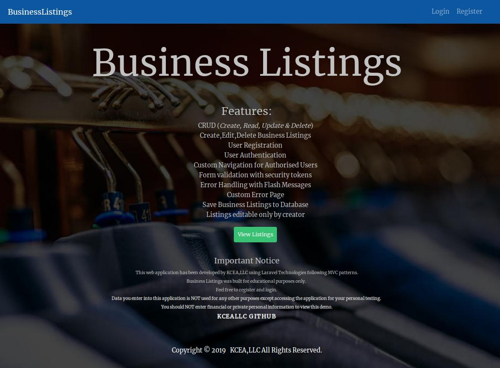
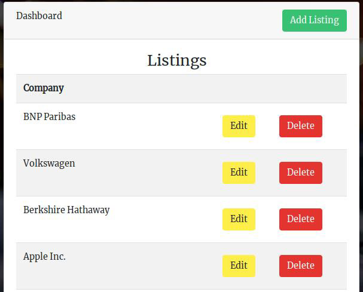
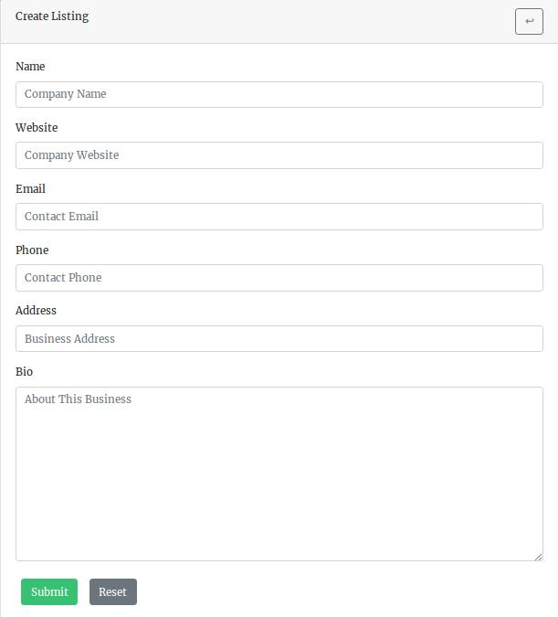

## Business Listings WebApp

## Description
**CRUD**  application that displays business entered by registered users.
All Business listings can be viewed publicly. 

Registered users can create, modify and delete only the listings that they have created.

## Features ##
<li>CRUD (<em>Create, Read, Update & Delete</em>)</li>
            <li>Create,Edit,Delete Business Listings</li>
            <li>User Registration</li>
            <li>User Authentication</li>
            <li>Custom Navigation for Authorised Users</li>
            <li>Form validation with security tokens</li>
            <li>Error Handling with Flash Messages</li>
            <li>Custom Error Page</li>
            <li>Save Business Listings to Database</li>
            <li>Listings editable only by creator</li>

## More Information ##
Live demo can be viewed here: 
[Business Listings Demo](https://businesslistings.kcenglishacademy.com/index.php)

This app was create for educational purposes. Information found or entered on this website is for testing only.

If you are a user testing the functionality of the app please **DO NOT**  enter private or sensitive information. 

Any/all offensive or unauthorised data will be immediately removed from the application.

## License

### Author:
**Developed**  by Nathan Malone

